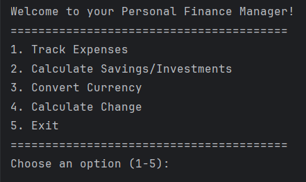
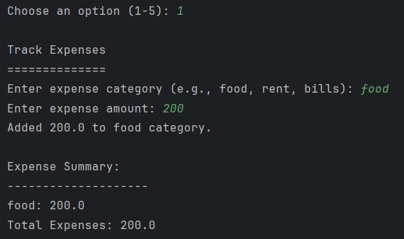
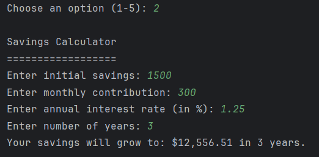
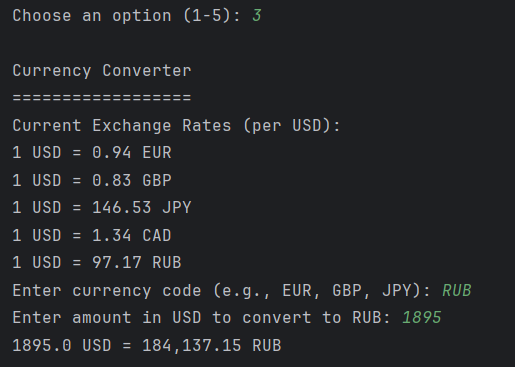
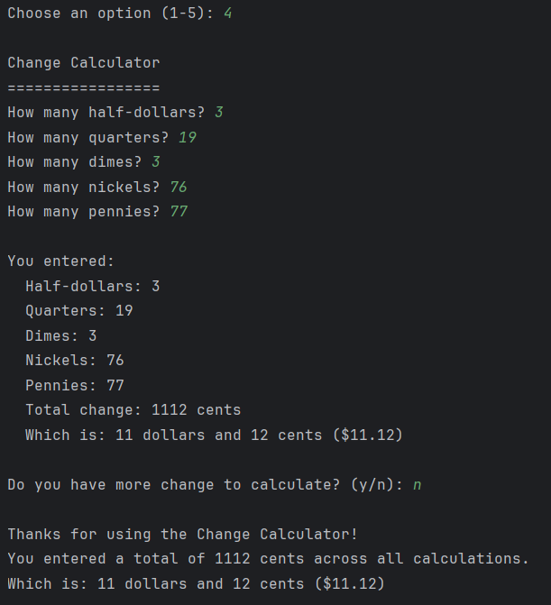
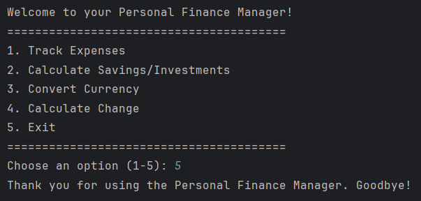

# PersonalFinanceManager
A continuation of a class project from Summer 2023

#### By Rachel Allen

## Description
The **Personal Finance Manager** is a simple command-line application designed to help users efficiently manage their finances. With its user-friendly interface, it offers tools to track expenses, plan savings, convert currencies, and calculate change. The app brings multiple financial utilities under one platform, making it easier for users to stay on top of their financial goals.

## Key Features
1. **Expense Manager**:
    - Track and categorize expenses with ease.
    - View a summary of all tracked expenses, including total expenditure.

2. **Savings Calculator**:
    - Calculate the future value of savings based on an initial amount, monthly contributions, and an annual interest rate.
    - Plan long-term financial goals with projected savings growth over a specified number of years.

3. **Currency Converter**:
    - Convert USD to popular currencies (e.g., EUR, GBP, JPY, CAD, RUB) using preset exchange rates.
    - View currently available exchange rates for quick reference.

4. **Change Calculator**:
    - Accurately calculate the total value of coins (half-dollars, quarters, dimes, nickels, and pennies).
    - Track multiple sets of coin calculations with a running total for convenient summaries.

5. **Main Menu Navigation**:
    - Access all features from an intuitive main menu.
    - Exit the application at any time with ease.

## How to Use
1. Upon running the application, you will be presented with a main menu:
   
    - **1** - Track Expenses: Add expenses categorized by type and view real-time summaries.
      
    - **2** - Calculate Savings/Investments: Input savings details and project future savings.
      
    - **3** - Convert Currency: Convert amounts from USD to various currencies using predefined exchange rates.
      
    - **4** - Calculate Change: Quickly calculate the monetary value of coins and get summaries.
      
    - **5** - Exit: Exit the application.
      

3. Input the number corresponding to the feature you'd like to use.
4. Follow the on-screen prompts to input the necessary data (e.g., amounts, categories, or rates).
5. After each operation, you'll either return to the main menu or, for some workflows (like the Change Calculator), continue based on additional prompts.

## Requirements
- **Python Version**: Python 3.6 or higher.
- **Operating System**: The application is platform-independent and runs on any OS with Python installed.

## Installation
1. Clone or download the repository:
``` bash
   git clone <repository_url>
   cd personal-finance-manager
```
1. Run the `finance_manager.py` script in your terminal:
``` bash
   python finance_manager.py
```
1. Follow the application prompts to begin managing your finances!
